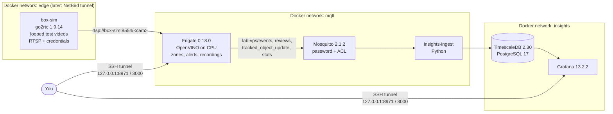

# AI Box platform: Phase 1 lab (Frigate on the VPS)

LAB/STAGING stack. **Not a production NVR.** It exists to:

1. learn and validate Frigate configuration;
2. produce real MQTT events and turn them into insights before the Jetson box arrives;
3. create templates for the edge boxes.

It runs on the OVH lab VPS (Ubuntu 26.04, 8 vCPU, 22 GB RAM, no GPU) in `~/aibox-platform`, which is a
clone of branch `phase1/vps-lab` of this repository.

> **This repository is public.** Never commit `.env`, passwords, IP addresses, client names, footage or
> snapshots. `.gitignore` already excludes all runtime data and secrets.

---

## Contents

- [Architecture](#architecture)
- [What runs](#what-runs)
- [Ports: what binds where](#ports-what-binds-where)
- [Reaching the UIs](#reaching-the-uis)
- [Where the credentials live](#where-the-credentials-live)
- [Operations: install, start, stop, update, backup](#operations)
- [Verifying the pipeline](#verifying-the-pipeline)
- [Frigate lab configuration](#frigate-lab-configuration)
- [Insights v0](#insights-v0)
- [Connecting a real box](#connecting-a-real-box)
- [Enabling AI features](#enabling-ai-features)
- [Security notes](#security-notes)
- [GDPR / CNIL notes](#gdpr--cnil-notes)
- [Troubleshooting](#troubleshooting)
- [Roadmap: Phase 2](#roadmap-phase-2)

---

## Architecture



- **box-sim** stands in for an AI box / site gateway. It serves camera streams exactly as a real box would.
  When a box exists, only `BOX_HOST` changes (see [Connecting a real box](#connecting-a-real-box)).
- The **insights pipeline only reads MQTT events keyed by site** (`topic_prefix`). It therefore works
  whether detection runs centrally (this lab) or on the Jetson (recommended for production).

## What runs

| Service | Image (pinned by digest in `docker-compose.yml`) | Role |
|---|---|---|
| `box-sim` | `alexxit/go2rtc:1.9.14` | Plays `test-media/*.mp4` in a loop as RTSP cameras `yard_cam`, `warehouse_cam` |
| `frigate` | `ghcr.io/blakeblackshear/frigate:0.18.0` | Detection, tracking, zones, alert/detection recordings, snapshots |
| `mosquitto` | `eclipse-mosquitto:2.1.2-alpine` | MQTT broker (password auth, ACL, no anonymous access) |
| `timescaledb` | `timescale/timescaledb:2.30.0-pg17` | Insights database |
| `insights-ingest` | built from `insights/ingest/` (Python 3.13.15, paho-mqtt 2.1.0, psycopg 3.3.5, hash-pinned) | MQTT to database |
| `grafana` | `grafana/grafana:13.2.2` | Dashboards (provisioned from `insights/grafana/`) |

Host: Docker Engine 29.8.1 + Compose v5.5.1 from Docker's apt repository, UFW active, unattended security
upgrades enabled.

## Ports: what binds where

| Port | Service | Bound to | Authentication | Reachable from |
|---|---|---|---|---|
| 22/tcp | sshd (host) | `0.0.0.0`, `[::]` | SSH key or password; UFW rate limit (`limit`) | Internet |
| 8971/tcp | Frigate UI/API (nginx, **HTTPS**, self-signed) | host `127.0.0.1` only | Frigate login (JWT), login rate limit | SSH tunnel |
| 3000/tcp | Grafana | host `127.0.0.1` only | Grafana login | SSH tunnel |
| 5000/tcp | Frigate internal API (**unauthenticated, admin rights**) | not published | none | Docker networks `edge`, `mqtt` only (Prometheus will scrape `/api/metrics` here) |
| 1984/tcp, 8554/tcp | Frigate's internal go2rtc API / RTSP restream | loopback **inside** the Frigate container | none | Frigate container only |
| 8555/tcp+udp | Frigate WebRTC | not published | n/a | not used (live view uses MSE over 8971) |
| 1883/tcp | Mosquitto | not published | username/password + ACL | Docker network `mqtt` |
| 8554/tcp | box-sim RTSP | not published | RTSP username/password | Docker network `edge` |
| 5432/tcp | TimescaleDB | not published | role passwords | Docker network `insights` |

**Rule:** Docker-published ports bypass UFW. Every `ports:` entry must start with `127.0.0.1:`.
`/etc/docker/daemon.json` also defaults new networks to `127.0.0.1` host binding (defense in depth) and
rotates container logs (`local` driver, 5 x 20 MB).

Verified on 2026-09-16:

- **External scan:** an nmap TCP scan over IPv4 from outside found only 22 open. All stack ports are filtered.
- **Host sockets:** `ss -tulpn` shows only 22 on non-loopback addresses.
- **Docker NAT:** rules match only destination `127.0.0.1`, with no IPv6 publish rules.
- **UFW:** v4 and v6 both deny incoming except 22.

## Reaching the UIs

From your laptop (the `aibox-vps` alias lives in your `~/.ssh/config`; plain form: `ubuntu@<vps-ip>`):

```bash
ssh -N -L 8971:127.0.0.1:8971 -L 3000:127.0.0.1:3000 aibox-vps
```

- **Frigate:** <https://127.0.0.1:8971>. Accept the self-signed certificate warning. Use `127.0.0.1`, not
  `localhost`, because the tunnel endpoint is IPv4 only.
- **Grafana:** <http://127.0.0.1:3000>. The home dashboard is "AI Box - Site overview".

## Where the credentials live

| Secret | Location | Notes |
|---|---|---|
| All service secrets | VPS `~/aibox-platform/.env` (mode 600) | Generated by `scripts/bootstrap.sh`. Read one value: `grep '^GRAFANA_ADMIN_PASSWORD=' .env \| cut -d= -f2-` |
| Mosquitto users | `mosquitto/config/passwd` (hashes), `acl`, `healthcheck.conf` | Owner 1883:1883, mode 600, generated from `.env` |
| MQTT operator (for `mosquitto_sub`) | VPS `~/.config/aibox/mqtt-operator.conf` (mode 600) | Read-only user `operator` on `lab-vps/#` |
| Frigate `admin` | Hashed in `frigate/config/frigate.db` | Printed **once** in the Frigate logs on first start. Store it in a password manager and change it in *Settings, Users*. See [reset procedure](#lost-frigate-admin-password) |
| Frigate JWT secret | `frigate/config/.jwt_secret` | Auto-generated |
| Grafana `admin` | `GRAFANA_ADMIN_PASSWORD` in `.env` | Applied on Grafana's **first** start only; later changes are made in the Grafana UI |
| DB roles `insights_writer`, `grafana_reader` | `INSIGHTS_DB_PASSWORD`, `GRAFANA_DB_PASSWORD` | Applied on the database's **first** initialisation only (rotate with `ALTER ROLE`) |
| SSH to the VPS | Laptop `~/.ssh/id_ed25519_aibox_vps` | Host alias `aibox-vps` |

MQTT users and ACL (`mosquitto/acl.template`):

| User | Access |
|---|---|
| `frigate` | read/write `lab-vps/#` |
| `insights` | read `+/events`, `+/reviews`, `+/tracked_object_update`, `+/available`, `+/stats`, `+/+/status/+` |
| `operator` | read `lab-vps/#` |
| `healthcheck` | connect only |

**Rotate an MQTT password:**

1. Empty the value in `.env`, then run `./scripts/bootstrap.sh` (it generates a new value and reloads Mosquitto).
2. Run `sudo docker compose up -d frigate insights-ingest` so they pick up the new value.

## Operations

All commands run on the VPS in `~/aibox-platform`. Docker needs `sudo`: the `ubuntu` user is deliberately
not in the `docker` group, which would be root-equivalent.

### First install (fresh host with Docker)

```bash
git clone --branch phase1/vps-lab https://github.com/Oussama-CyberS7/frigates7.git ~/aibox-platform
cd ~/aibox-platform
./scripts/bootstrap.sh          # .env with random secrets, Mosquitto users/ACL, runtime folders
./scripts/fetch-test-media.sh   # download + sha256 verify + prepare test videos (no audio)
sudo docker compose up -d --build
sudo docker compose logs frigate | grep -E 'User: admin|Password:'   # one-time admin password
```

On the operator laptop, clone with `git clone --recurse-submodules` to also get `frigate-upstream/`
(Frigate source at tag v0.18.0, used as the reference for config keys).

### Start, stop, status, logs

```bash
sudo docker compose up -d                   # start (or apply compose changes)
sudo docker compose ps                      # status + health
sudo docker compose logs -f --tail 100 frigate
sudo docker compose restart frigate         # restart one service (keeps its logs)
sudo docker compose stop                    # stop everything (containers kept)
sudo docker compose down                    # remove containers + networks (volumes and data kept)
```

`restart: unless-stopped` brings everything back after a reboot.

### Update

Configuration change (authored on the laptop, pushed to the branch):

```bash
git pull --ff-only
# validate Frigate config in the real image BEFORE applying (config mounted read-only)
sudo docker compose run --rm --no-deps -T -v "$PWD/frigate/config:/config:ro" \
  --entrypoint python3 -w /opt/frigate frigate -u -m frigate --validate-config
sudo docker compose up -d --build
```

Frigate settings changed from the Frigate UI are written to `frigate/config/config.yml` on the VPS. Copy
them back into git, or they will conflict with the next `git pull`.

Frigate version upgrade:

1. Read the release notes (breaking config changes).
2. Take a [backup](#backup).
3. Get the new digest: `sudo docker buildx imagetools inspect ghcr.io/blakeblackshear/frigate:<version> | grep -m1 Digest`.
4. Update the image line in `docker-compose.yml`.
5. On the laptop, run `git -C frigate-upstream checkout v<version>`, commit and push.
6. On the VPS: pull, validate (command above), then `sudo docker compose up -d`.

Other images follow the same pattern: tag plus digest, never `latest`.

Host OS:

- Security updates install automatically (unattended-upgrades, no automatic reboot).
- Docker packages are **not** covered. Update them with `sudo apt update && sudo apt upgrade`.
- If `/var/run/reboot-required` exists, plan a reboot.

### Backup

Tested on 2026-09-16. The archives contain secrets and personal data: keep them private (encrypt before
copying off the host) and delete them after 30 days.

```bash
umask 077; ts=$(date -u +%Y%m%dT%H%M%SZ); B=~/backups/$ts; mkdir -p "$B"
# 1. insights database
sudo docker compose exec -T timescaledb pg_dump -U postgres -d insights -Fc </dev/null > "$B/insights.dump"
# 2. Frigate database (SQLite online backup, consistent while running)
sudo docker compose exec -T frigate python3 -c "import sqlite3; s=sqlite3.connect('/config/frigate.db'); d=sqlite3.connect('/tmp/frigate-backup.db'); s.backup(d); d.close()" </dev/null
sudo docker compose cp frigate:/tmp/frigate-backup.db "$B/frigate.db" && sudo docker compose exec -T frigate rm -f /tmp/frigate-backup.db </dev/null
# 3. configuration + secrets
sudo tar -czf "$B/config-and-secrets.tgz" .env frigate/config/config.yml frigate/config/.jwt_secret mosquitto/config
# 4. Grafana state (dashboards themselves are provisioned from git)
sudo docker compose exec -T grafana sh -c 'tar -czf - -C /var/lib/grafana .' </dev/null > "$B/grafana.tgz"
sudo chown -R "$USER:" "$B"
# copy off-host, encrypted (from the laptop):
#   ssh aibox-vps "tar -C ~/backups -cf - $ts" | gpg -c > aibox-backup-$ts.tar.gpg
```

Lab recordings in `frigate/storage/` are test footage and are not backed up.

Restore notes:

- **TimescaleDB:** restore into a fresh database with `SELECT timescaledb_pre_restore();`, then
  `pg_restore -U postgres -d insights`, then `SELECT timescaledb_post_restore();`.
- **Frigate:** stop Frigate, copy `frigate.db` into `frigate/config/`, start Frigate.

## Verifying the pipeline

```bash
# MQTT: live messages (operator credentials come from the 0600 file via stdin, never in argv/ps)
sudo docker compose exec -T mosquitto mosquitto_sub -o /dev/stdin -h 127.0.0.1 -t 'lab-vps/#' -v -W 30 \
  < ~/.config/aibox/mqtt-operator.conf

# Prometheus metrics from inside the Docker network
sudo docker compose exec -T insights-ingest python -c \
  "import urllib.request; print(urllib.request.urlopen('http://frigate:5000/api/metrics').read().decode()[:600])" </dev/null

# Detector and camera health
sudo docker compose exec -T frigate curl -s http://127.0.0.1:5000/api/stats </dev/null | python3 -m json.tool | head -40

# Insights rows
sudo docker compose exec -T timescaledb psql -U postgres -d insights -c \
  "SELECT camera, label, count(*) FROM tracked_objects GROUP BY 1, 2 ORDER BY 1, 2;" </dev/null
```

Measured on 2026-09-16:

- **Detector:** OpenVINO on CPU averages 9-12 ms per inference; both cameras run at 5 fps with 0 skipped frames.
- **CPU:** Frigate uses about 60-70% of one vCPU.
- **Events:** person and car events, including loading_dock alerts, reach `lab-vps/events` and the database.

## Frigate lab configuration

`frigate/config/config.yml`. Every key was checked against the v0.18.0 pydantic models and passes
`--validate-config` in the real image.

- **Detector:** `openvino` on `CPU` with the bundled SSDLite MobileNet v2.
  - Frigate's docs say OpenVINO in CPU mode is often more efficient than the `cpu` detector, which is marked
    "not recommended". Frigate 0.18 itself defaults new installs to this.
  - This vCPU exposes AVX2, which Frigate requires. It presents as Haswell, while Intel's official list starts
    at Skylake; it works in practice (measured above).
- **Trucks:** the image rewrites `truck` to `car` in the labelmap. `model.labelmap: {8: truck}` restores it.
  The test clips contain no trucks.
- **Cameras:**
  - `yard_cam`: 768x432, parking lot. Zone `loading_dock` with `loitering_time: 3`; alerts require the zone,
    and everything else becomes a detection.
  - `warehouse_cam`: 1280x720, person only.
  - Both detect at 5 fps and receive 10 fps streams with a 1 s GOP.
- **Recording:** alerts and detections only (`continuous` and `motion` at 0 days).
  - **Retention is 7 days** for clips and snapshots. Policy maximum is 30 days, but looped clips generate
    activity almost non-stop (about 11 GB/day measured), so 30 days would not fit the disk.
  - Site templates use at most 30 days.
- **No audio:** `ffmpeg.output_args.record: preset-record-generic`. The 0.18 default
  `preset-record-generic-audio-aac` keeps audio. Audio detection is off, and the test videos have no audio stream.
- **Disabled:** semantic search, face recognition, LPR, GenAI (no `genai:` section), Birdseye, per-camera MQTT
  snapshots, version check.
- **Auth:** enabled with `failed_login_rate_limit: "1/second;5/minute;20/hour"`.
- **shm_size 512mb.** The 0.18.0 runtime check is stricter than the docs formula:
  - Per-frame size: sum over cameras of `(w*h*1.5 + 270480)/1048576` MB, plus 3.2 MB reserved for two more
    720p cameras.
  - Minimum: 50 MB + 20 frames. Full buffer: 50 MB + 50 frames.
  - Lab: 5.5 MB per frame, so 160 MB minimum and 325 MB full.
  - Jetson with 8 cameras at 720p: 16 MB per frame, so 370 MB minimum and 850 MB full.

Test media: two clips from Intel's `sample-videos` (CC BY 4.0). See [test-media/README.md](test-media/README.md)
for attribution and privacy notes.

## Insights v0

- **Ingest** (`insights/ingest/ingest.py`):
  - Subscribes to every site. The site id is the first topic level, i.e. the box's `topic_prefix`.
  - Uses a persistent MQTT v5 session with QoS 1 and acknowledges only after the database commit, so nothing
    is lost across ingest restarts.
  - Reconnects to the database automatically (tested with a database restart).
- **Tables:**
  - `tracked_objects`: one row per tracked object.
  - `zone_visits`: enter/exit times computed from `current_zones`, giving dwell time.
  - `review_items`: alerts and detections.
  - `object_updates`: enrichment updates.
  - `site_status` and `status_events`: availability and camera roles.
  - `frigate_stats`: detector speed, fps and the full stats JSON.
- **Aggregates:** the continuous aggregates `objects_hourly` and `zone_dwell_hourly`.
- **Retention:** raw tables are kept **30 days**. Hourly aggregates (counts and durations, no personal data)
  are kept 400 days. Telemetry to Timescale is off.
- **Roles:** `insights_writer` (ingest) and `grafana_reader` (read-only; writes are denied, verified).
- **Dashboard** "AI Box - Site overview":
  - Stats: people, vehicles, alerts, loading-dock visits, average dwell, box status.
  - Charts: objects per hour, alerts vs detections, dwell per hour, detector inference speed.
  - Tables: latest loading-dock visits, recent alerts, component status.

The schema lives in `insights/db/init/`. It runs only when the database volume is first created; change a
live database with SQL migrations.

## Connecting a real box

Phase 2 outline.

1. **Tunnel:** join the VPS and the box to NetBird. RTSP must only be reachable over the tunnel, never on the
   internet.
2. **Streams:** on the box, serve camera **sub-streams** with go2rtc (or Frigate's restream) with RTSP
   credentials, e.g. 640x360-1280x720, 5-10 fps, GOP = fps, video only.
3. **VPS `.env`:** set `BOX_HOST=<box NetBird IP>`, `BOX_RTSP_USER`, `BOX_RTSP_PASSWORD`.
4. **Frigate config:** set camera names and detect resolutions in `config.yml`, recompute `shm_size`, validate,
   then run `sudo docker compose up -d frigate`. Remove `box-sim`.
5. **One site = one `topic_prefix`**, so the insights pipeline separates sites automatically.

**Recommended production variant (edge inference):**

- Frigate runs on the Jetson (`ghcr.io/blakeblackshear/frigate:0.18.0-tensorrt-jp6`, a different
  detector/model block).
- The box's Mosquitto bridges `events`, `reviews`, `tracked_object_update`, `available` and `stats` to the
  central broker over TLS, never snapshot images.
- The ingest and dashboards stay unchanged.

Before streaming client video to this VPS:

- **Location:** it is hosted in **OVH Beauharnois, Canada**, so this is a cross-border transfer (check with
  your DPO / CNIL / CNDP).
- **Bandwidth:** plan roughly 0.3-1 Mbps upload per camera, continuously.

## Enabling AI features

All are disabled. Requirements come from the v0.18.0 docs and config models. Enable one at a time, then
validate and restart.

| Feature | Config | Documented requirements | Notes |
|---|---|---|---|
| Semantic search | `semantic_search: {enabled: true, model: jinav1, model_size: small}` (optional `reindex: true` once) | At least 8 GB RAM, AVX + AVX2; GPU optional (16 GB RAM + GPU recommended) | This VPS qualifies for `small` on CPU. Downloads Jina models on first start. `jinav2` on CPU is not recommended |
| Face recognition | `face_recognition: {enabled: true, model_size: small}` | AVX + AVX2; `large` recommended only with GPU/NPU; 5-10 images per person | **Biometric data (GDPR art. 9):** legal basis + DPIA first. Face images in `/media/frigate/clips/faces` have no automatic retention |
| License plates | `lpr: {enabled: true, model_size: small}` | At least 4 GB RAM, AVX + AVX2 | Plates are personal data. Runs on vehicle objects |
| GenAI descriptions | `genai: {local: {provider: ollama, base_url: http://<ollama>:11434, model: qwen3-vl:4b, roles: [descriptions]}}` + `objects.genai.enabled: true` and/or `review.genai.enabled: true` | 7B vision models need about 8 GB RAM/VRAM; a GPU is practical. Providers: ollama, llamacpp, openai, azure_openai, gemini | Prefer a local model on the box (Qwen3-VL). Cloud providers receive images of people |

In 0.18, admins can also enable these features from the Frigate UI, which writes `config.yml`. Keep admin
accounts to a minimum.

## Security notes

- **SSH password login is enabled** (owner decision, 2026-09-16) alongside key login. The VPS received about
  8,000 password-guessing attempts in its first 24 hours. Strongly recommended:
  - a long random password for `ubuntu`;
  - fail2ban (suggestion only, not installed):
    ```ini
    # /etc/fail2ban/jail.local
    [sshd]
    enabled   = true
    backend   = systemd
    port      = 22
    maxretry  = 5
    findtime  = 10m
    bantime   = 1h
    banaction = ufw
    ```
    On Ubuntu 26.04, OpenSSH logs some lines as `sshd-session`. Check the filter with
    `sudo fail2ban-regex systemd-journal sshd` before relying on it.
  - key-only SSH when practical.
- **UFW:** `default deny incoming`, `limit 22/tcp` (IPv4 and IPv6).
  - `limit` blocks an address after 6 new connections in 30 s. For automation, reuse one connection with
    `ControlMaster auto` / `ControlPersist`.
- **OVH Edge Network Firewall** (optional extra layer, IPv4 only, stateless):
  - Allow TCP `established`, UDP source port 53 and SSH, then deny the rest.
  - IPv6 is filtered only by UFW.
- **Frigate 0.18.0 advisories:** published advisories without a patched version as of 2026-09-16 include
  GHSA-w3c4-957q-2jw4, GHSA-4xp7-86rr-9758 and GHSA-74x4-gw64-2mq5. Exposure is limited by a single admin
  account, tunnel-only access, and go2rtc not being reachable. Watch for 0.18.x patch releases.
- **Port 5000:** Frigate's port 5000 is unauthenticated and reachable from containers on the `edge` and `mqtt`
  networks. Do not attach untrusted containers to those networks.

## GDPR / CNIL notes

| Requirement | Implementation in this lab |
|---|---|
| Footage 30 days max | Clips and snapshots 7 days; insights raw rows 30 days; only anonymous hourly counts kept longer (400 days). **Frigate exports never expire**: delete them manually |
| No audio | Record preset without audio, audio detection off, box-sim forwards video only, test files have no audio stream |
| Never film workstations continuously | No continuous or motion recording; alerts only in defined zones on the yard camera. Frigate masks are not privacy masks (0.18 docs: "not for hiding an area from Frigate"), so camera placement must avoid workstations |
| Faces = biometric data | Face recognition off (and LPR off). Enabling requires a DPIA |
| Minimise copies | No retained snapshot images on MQTT (`cameras.*.mqtt.enabled: false`); Mosquitto persistence holds no images |
| Access control | SSH tunnel only; Frigate and Grafana authentication; least-privilege DB roles |
| Data location | VPS in Canada (OVH BHS). Consider an EU region before any real client data |
| Test data | CC BY 4.0 clips contain real people: internal testing only |

## Troubleshooting

**"The current SHM size ... is too small"**: increase `shm_size` using the runtime formula in
[Frigate lab configuration](#frigate-lab-configuration), then `sudo docker compose up -d frigate`.

### Lost Frigate admin password

The password is printed only on first start, and recreating the container (`up -d` after a compose change,
`down`) discards old logs. To reset it:

1. Add `reset_admin_password: true` under `auth:` in `frigate/config/config.yml`.
2. Run `sudo docker compose restart frigate`.
3. Read the password: `sudo docker compose logs frigate | grep 'Password:' | tail -1`.
4. **Remove the flag again** (`git checkout -- frigate/config/config.yml`) and restart. While the flag is set,
   the password is reset on every start.

**Login returns HTTP 429**: the login rate limit (`1/second;5/minute;20/hour`) was hit. Wait, then retry.

**Browser can't connect to 127.0.0.1:8971**:

- Check that the tunnel is running.
- Use `https://`, not `http://`.
- Use `127.0.0.1` rather than `localhost`.

**Camera offline / no frames**:

- Check `sudo docker compose logs box-sim`.
- Check that `test-media/yard_cam.mp4` and `test-media/warehouse_cam.mp4` exist (`./scripts/fetch-test-media.sh`).
- Check that `BOX_RTSP_*` in `.env` are unchanged since box-sim started (`sudo docker compose up -d box-sim frigate`).
- List Frigate's go2rtc streams:
  `sudo docker compose exec -T frigate curl -s http://127.0.0.1:1984/api/streams </dev/null | python3 -m json.tool`.

**No MQTT events**:

- Check `sudo docker compose logs mosquitto` for `not authorised`, and that `lab-vps/available` is `online`.
- Re-run `./scripts/bootstrap.sh` (regenerates users and ACL, reloads the broker).

**Mosquitto exits with "Unable to open pwfile"**: ownership or permissions changed. Re-run
`./scripts/bootstrap.sh` (files must be 1883:1883, mode 600).

**`install: invalid user '1883'`** (Ubuntu 26.04): the uutils coreutils `install` rejects unknown numeric
owners. The scripts use `chown` instead.

**Frigate starts in "safe mode"**: `config.yml` is invalid (0.18 rejects unknown or removed keys). Run the
validate command from [Update](#update) and fix the reported key.

**insights-ingest unhealthy**: check `sudo docker compose logs insights-ingest`. It reconnects to MQTT and the
database automatically; the healthcheck fails while either is down.

**Grafana panels show "No data"**:

- Check the time range and the `Site`/`Camera` variables (the camera list is empty until the first objects arrive).
- Check that the ingest is healthy.

**TimescaleDB jobs**: check their status with
`SELECT job_id, proc_name, hypertable_name, last_run_status, total_failures FROM timescaledb_information.job_stats JOIN timescaledb_information.jobs USING (job_id);`.
A few failures right after a restart are normal.

**`docker compose exec` inside a here-doc or script eats the rest of the script**: it reads stdin. Add `</dev/null`.

**Disk usage**: `du -sh frigate/storage`. Retention is enforced hourly. Frigate also deletes the oldest
recordings when the disk is almost full.

**Locked out by UFW rate limit**: wait 30 s. As a last resort, use the OVH KVM console (password login) and
run `sudo ufw disable`.

## Roadmap: Phase 2

1. **NetBird** (or Headscale): VPS + first box. Move box-sim to the laptop to test streams over the tunnel.
2. **Prometheus + Grafana:**
   - Scrape `http://frigate:5000/api/metrics` on the Docker network, plus node-exporter and cAdvisor.
   - Uptime Kuma for availability.
   - One Grafana organization per client.
3. **PostgreSQL ingest hardening:**
   - Schema migrations tool.
   - Per-client sites and tenants.
   - Snapshot pipeline to S3-compatible storage with 30-day lifecycle rules.
   - LLM daily report from aggregates only.
4. **Jetson template:**
   - `0.18.0-tensorrt-jp6` image and a TensorRT/ONNX model with a `truck` label.
   - shm sized for 8 cameras.
   - Mosquitto TLS bridge to the VPS (events/reviews/updates/available/stats only).
   - Same `record`/`audio`/privacy blocks as this lab.
